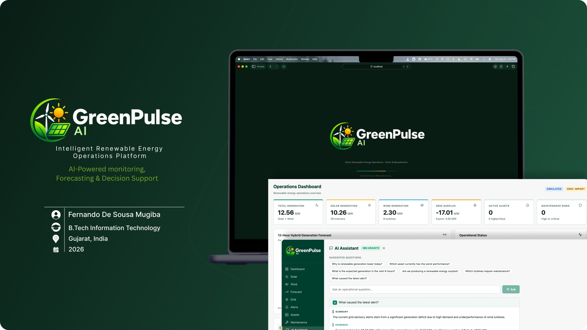
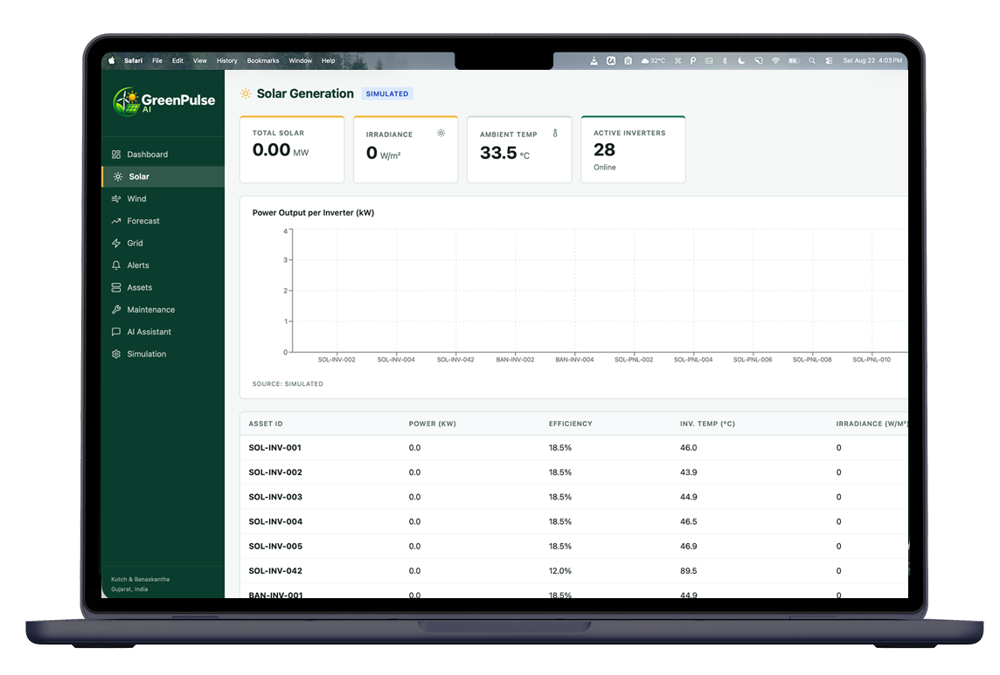
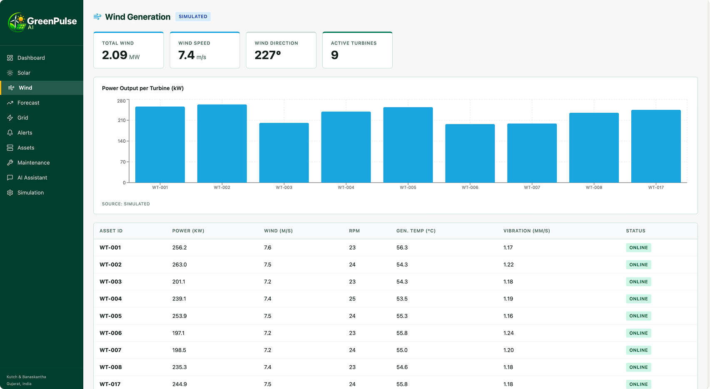
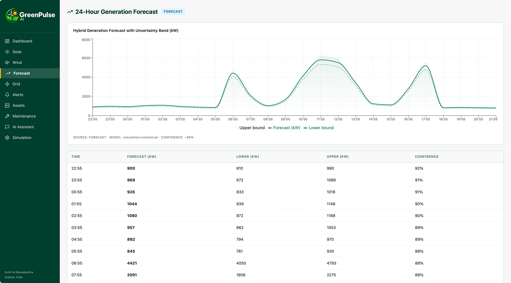

# GreenPulse AI

<p align="center">
  
</p>

<h2 align="center">Intelligent Renewable Energy Operations Platform</h2>

<p align="center">
  AI-powered monitoring, forecasting, simulation and decision support
  for hybrid solar and wind energy systems.
</p>

<p align="center">
  <strong>GreenPulse AI</strong> is designed to transform renewable-energy
  operational data into meaningful information for monitoring, analysis,
  forecasting and operational decision-making.
</p>

## Project Overview

GreenPulse AI is an intelligent renewable-energy operations platform designed
to support the monitoring and analysis of hybrid solar and wind energy systems.
The platform centralizes operational information from renewable assets,
generation systems and grid conditions into a unified interface.

The system combines operational dashboards, renewable-energy monitoring,
short-term forecasting, alert management, asset monitoring, maintenance-risk
analysis, simulation capabilities and an AI conversational assistant.
The platform can operate with simulated data, allowing development,
testing and demonstration without requiring direct access to physical
renewable-energy infrastructure.

## Problem Statement

Renewable-energy operators may need to monitor multiple assets and operational
parameters simultaneously. Identifying underperforming assets, generation
deficits, maintenance risks and grid conditions can become difficult when
information is distributed across different systems.

GreenPulse AI addresses this challenge by providing a centralized operational
platform that combines monitoring, visualization, forecasting, alerts,
simulation and AI-assisted analysis. This approach helps transform operational
data into information that can support faster and more informed decisions.

## Main Objective

The main objective of GreenPulse AI is to develop an intelligent renewable-energy
operations platform capable of monitoring hybrid solar and wind systems,
analysing operational conditions and assisting users in making better
operational decisions.

## Core Features

### Dashboard

The operational dashboard provides a centralized view of the renewable-energy
system. It displays key performance indicators, generation information,
operational status, alerts, maintenance risks, forecasts and grid conditions.

### Solar Monitoring

The Solar Monitoring module provides visibility into solar-energy generation
and connected solar assets. It includes information such as solar generation,
irradiance, ambient temperature, inverter activity, efficiency and asset status.

<p align="center">
  
</p>

### Wind Monitoring

The Wind Monitoring module provides operational visibility into wind generation
and turbine activity. It allows users to analyse wind contribution to the
hybrid renewable-energy system and monitor turbine-related information.

<p align="center">
  
</p>

### Forecasting

The Forecasting module provides short-term renewable-generation predictions.
Forecast information can be used to understand expected generation levels,
possible variations and potential generation deficits or surpluses.

<p align="center">
  
</p>

### Grid Monitoring

The Grid Monitoring module analyses renewable generation in relation to
grid demand. It helps identify generation surplus or deficit conditions
and provides information that can support operational planning.

### Alert Management

The platform detects and presents operational alerts according to their
severity. Users can identify active conditions and distinguish between
normal, warning, high and critical operational situations.

### Asset Management

GreenPulse AI provides centralized visibility of renewable-energy assets,
including solar inverters and wind turbines. Asset information can include
operational status, generation, efficiency and other relevant parameters.

### Maintenance Monitoring

The maintenance module helps identify assets associated with potential
maintenance risks. High and critical conditions can be highlighted to
support proactive operational management.

### AI Assistant

The AI Assistant allows users to interact with the platform using
natural-language questions. It provides AI-assisted operational information,
analysis and recommendations based on available system information.

The project integrates IBM AI services to support intelligent interaction
and operational decision support.

### Simulation

GreenPulse AI includes simulation capabilities that generate operational
data for testing, development, demonstration and analysis.

Simulation makes it possible to demonstrate the platform without requiring
direct connection to physical solar panels, inverters, wind turbines or
other renewable-energy infrastructure.

### Data Visualization

Operational information is presented using dashboards, charts, KPI cards,
tables, indicators and status components to make complex renewable-energy
data easier to understand.

### Responsive Interface

The platform is designed to adapt to different screen sizes, including
desktop, tablet and mobile devices.

## System Architecture

GreenPulse AI follows a modular architecture in which the user interface,
backend services, data processing and AI capabilities work together.

The main architectural components include:

- Frontend application
- Backend services
- Operational data processing
- Renewable-energy simulation
- Forecasting services
- Alert and risk analysis
- AI Assistant
- IBM AI services
- REST-based communication
- Data visualization layer

The architecture allows the platform to separate presentation, processing,
AI capabilities and operational logic.

## Technology Stack

### Frontend

- TypeScript
- HTML
- CSS
- Component-based frontend architecture
- Recharts
- Lucide React

### Backend

- Python
- REST APIs
- Data processing
- Forecasting logic
- Simulation services
- Operational analysis

### Artificial Intelligence

- IBM watsonx.ai
- IBM Granite models
- IBM Cloud services
- AI-assisted operational analysis
- Natural-language interaction

### Development and Design Tools

- Git
- GitHub
- npm
- Sigma
- Canva
- Figma
- Browser Developer Tools

## Project Structure

```text
GreenPulse-AI/
│
├── backend/
│   ├── ...
│   └── ...
│
├── frontend/
│   ├── public/
│   └── src/
│       ├── assets/
│       │   ├── dashboard.png
│       │   ├── forecasting.png
│       │   ├── greenpulse-cover.jpg
│       │   ├── solar-monitoring.png
│       │   └── wind-monitoring.png
│       │
│       ├── components/
│       ├── hooks/
│       ├── pages/
│       ├── services/
│       └── ...
│
├── logo.png
├── README.md
└── .gitignore
